# YOURTRIP(유어트립)

### 배포 URL : [YOURTRIP](https://r3act-lion.github.io/YOURTRIP_DISTRIBUTION)

<br>

## 1. 프로젝트 소개

### 1.1 프로젝트 명 : YOURTRIP

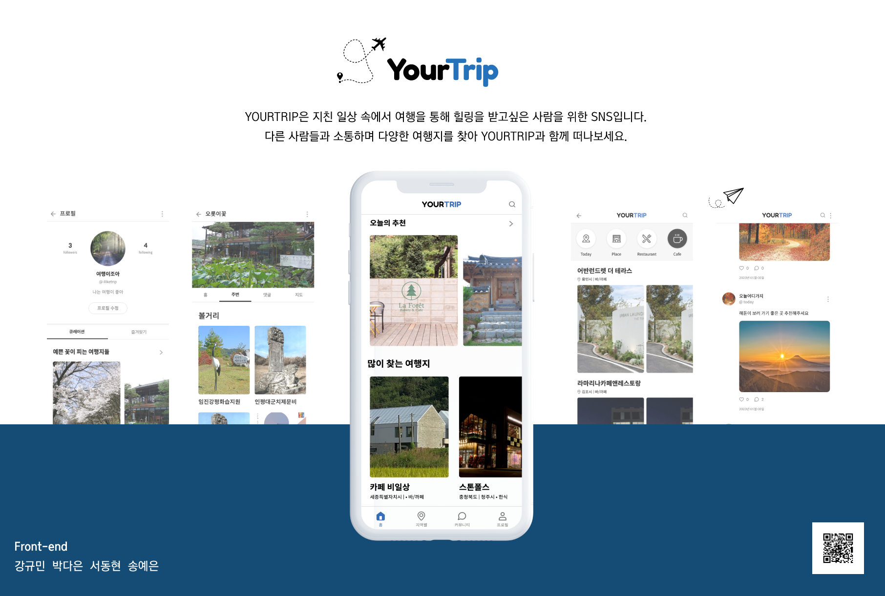

```
YOURTRIP 서비스는 지친 일상 속에서 여행을 통해 힐링을 받고 싶은 분들께 바치는 SNS입니다.
여행지와 각각 유명한 식당들에 대한 홍보 혹은 유저들과 소통을 하면서 자유롭게 활동이 가능합니다.

회원가입과 로그인 없이도 자유롭게 여행지 추천을 받을 수 있으며, 커뮤니티와 테마 등록 및 여행지 즐겨찾기 기능을 사용하기 위해서는 회원가입이 필요합니다.
```

### 1.2. 개발 환경

### [개발 기간] 2022.12.10 - 2023.01.03

### [사용 기술]

- Front-End

<div style="display:inline">


</div>

<br>

- Back-End: 제공된 API 사용

- 형상 관리 : github-flow 전략 사용  
  메인 브랜치에서는 충돌이 발생하지 않게 하고, 메인 브랜치의 역할만 할 수 있도록 기능 구현 또는 버그 수정 시 기능 단위별로 브랜치를 생성하는 방식을 사용했다. 각 브랜치의 이름은 어떤 일을 하는 지 알 수 있도록 설정하였으며, push 후에 브랜치를 삭제하는 형태로 사용하여 브랜치를 잘못 사용하는 경우를 방지했다.

<br>

## 2. 팀 소개 및 역할 분담

### 2.1 팀 소개 : R3act 🛫

|                                            **강규민**                                            |                                           **박다은**                                            |                                           **서동현**                                            |                                            **송예은**                                            |
| :----------------------------------------------------------------------------------------------: | :---------------------------------------------------------------------------------------------: | :---------------------------------------------------------------------------------------------: | :----------------------------------------------------------------------------------------------: |
|  |  |  |  |
|                              [jattett](https://github.com/jattett)                               |                           [daeun.park](https://github.com/ekdms5566)                            |                          [donghyeon.seo](https://github.com/sdh20282)                           |                       [coding-frog117](https://github.com/coding-frog117)                        |

<br>

## 2.2 역할 분담

### 👩🏻‍💻 강규민

- 공통 컴포넌트 제작 (이미지 업로드버튼,커뮤니티 컴포넌트)
- 토큰 관리
- 스플래쉬 페이지
- 로그인 페이지
- 회원가입 페이지
- 프로필 수정 페이지
- 로그아웃 기능

### 👩🏻‍💻 박다은

- 공통 컴포넌트 제작 (버튼•이미지 모듈, 이미지 슬라이드)
- 유어트립 페이지 디자인
- 팔로워, 팔로잉 리스트 구현
- 지역별 카테고리 여행지 리스트 출력
- 큐레이션 추가 페이지 구현
- 유저 및 장소 검색

### 🧑🏻‍💻 서동현

- 공통 컴포넌트 제작 (하단 네비게이션 바, 여행지 상세 페이지 내부 컴포넌트)
- 공공 데이터 API 가공 및 주기적 갱신
- 퍼블리싱 리팩토링
- 여행지 상세 페이지
- 데이터 저장
- 버그 Fix
- 배포

### 🧑🏻‍💻 송예은

- 공통 컴포넌트 제작 (지역별 카테고리 nav바, 지역별 리스트, 장소 컴포넌트)
- 게시물 작성, 수정, 삭제 기능
- 팔로우 언팔로우 기능
- 내 프로필 팔로잉 팔로우 리스트 구현
- 커뮤니티 피드리스트
- 나의 게시물 리스트
- 모달창 기능 구현

<br>

## 3. 프로젝트 기능 설명

[페이지별 기능 설명](https://github.com/R3act-lion/YOURTRIP.wiki.git)

| [0. 스플래쉬](https://github.com/R3act-lion/YOURTRIP/wiki/YOURTRIP#-splash)                                                          | [1. 로그인](https://github.com/R3act-lion/YOURTRIP/wiki/YOURTRIP#-%EB%A1%9C%EA%B7%B8%EC%9D%B8)                                                                        | [2. 회원가입](https://github.com/R3act-lion/YOURTRIP/wiki/YOURTRIP#-%ED%9A%8C%EC%9B%90%EA%B0%80%EC%9E%85)                                                              | 3. 프로필 설정                                                                                                                      |
| ------------------------------------------------------------------------------------------------------------------------------------ | --------------------------------------------------------------------------------------------------------------------------------------------------------------------- | ---------------------------------------------------------------------------------------------------------------------------------------------------------------------- | ----------------------------------------------------------------------------------------------------------------------------------- |
|                                                                                   | 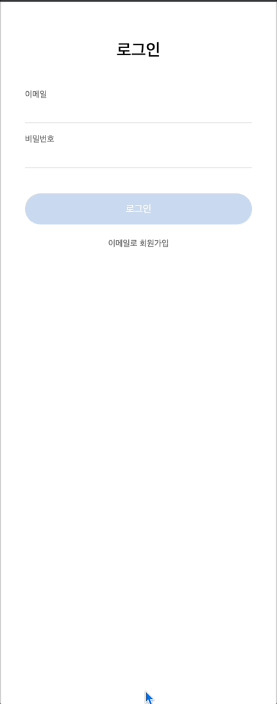                                                                                                                    | 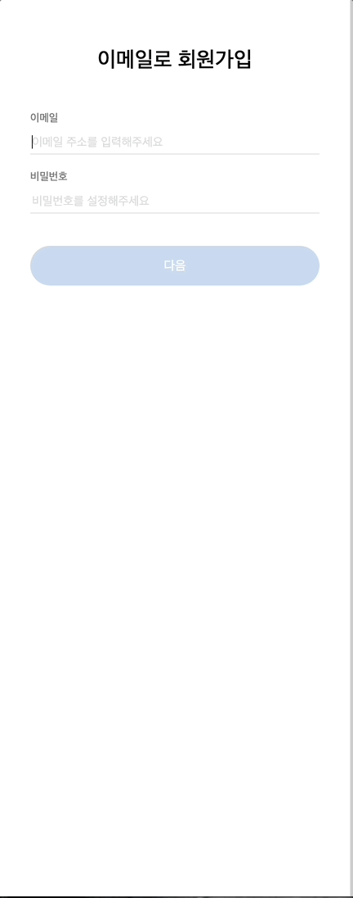                                                                                                                    | 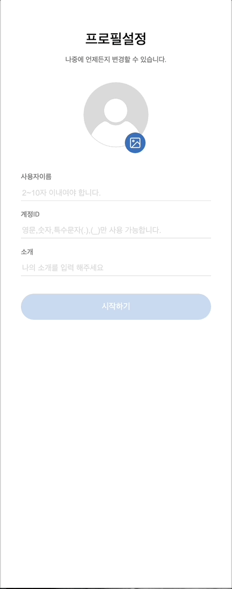                                                                          |
| [4. 하단 네비게이션](https://github.com/R3act-lion/YOURTRIP/wiki/YOURTRIP#1-%EB%84%A4%EB%B9%84%EA%B2%8C%EC%9D%B4%EC%85%98-%EB%B0%94) | [5. 홈](https://github.com/R3act-lion/YOURTRIP/wiki/YOURTRIP#-%ED%99%88)                                                                                              | 6. 홈 상세보기                                                                                                                                                         | [7.지역별 리스트](https://github.com/R3act-lion/YOURTRIP/wiki/YOURTRIP#-%EC%B9%B4%ED%85%8C%EA%B3%A0%EB%A6%AC)                       |
| 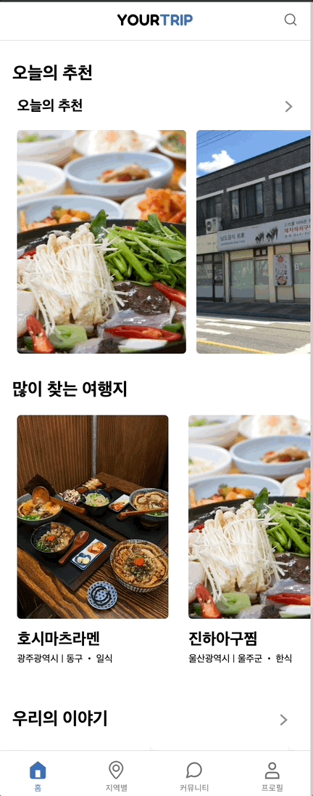                                                                                  | 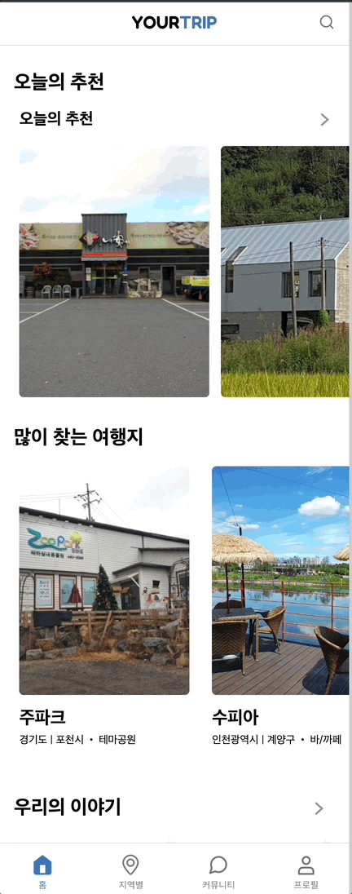                                                                                                                     |                                                                                                                 | 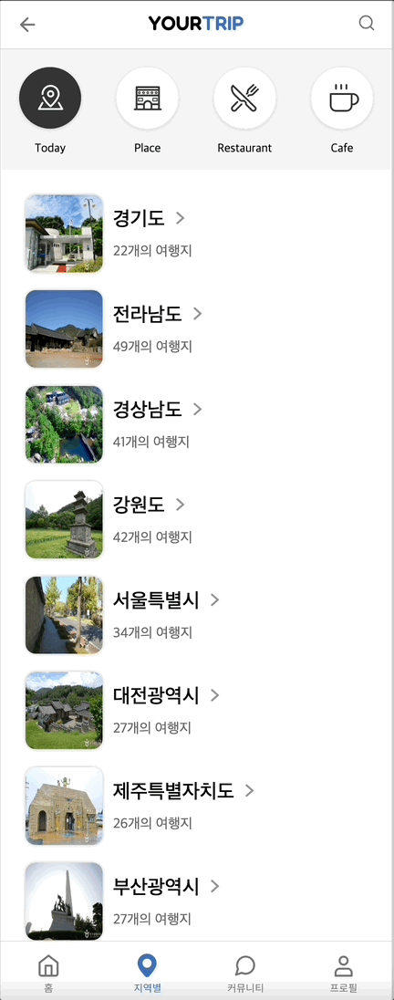                                                                                 |
| [8.커뮤니티 게시물 업로드](https://github.com/R3act-lion/YOURTRIP/wiki/YOURTRIP#-%EA%B2%8C%EC%8B%9C%EB%AC%BC-%EC%9E%91%EC%84%B1)     | [9. 커뮤니티 게시물 삭제](https://github.com/R3act-lion/YOURTRIP/wiki/YOURTRIP#-%EA%B2%8C%EC%8B%9C%EB%AC%BC-%EC%88%98%EC%A0%95-%EC%82%AD%EC%A0%9C-%EC%8B%A0%EA%B3%A0) | [10. 커뮤니티 게시물 수정](https://github.com/R3act-lion/YOURTRIP/wiki/YOURTRIP#-%EA%B2%8C%EC%8B%9C%EB%AC%BC-%EC%88%98%EC%A0%95-%EC%82%AD%EC%A0%9C-%EC%8B%A0%EA%B3%A0) | [11. 다른 사용자 프로필 확인](https://github.com/R3act-lion/YOURTRIP/wiki/YOURTRIP#-%EC%9C%A0%EC%A0%80-%ED%94%84%EB%A1%9C%ED%95%84) |
| 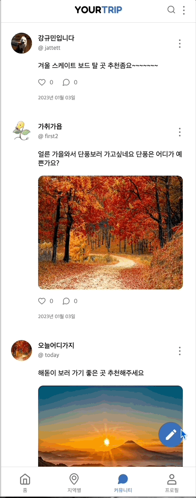                                                                          | 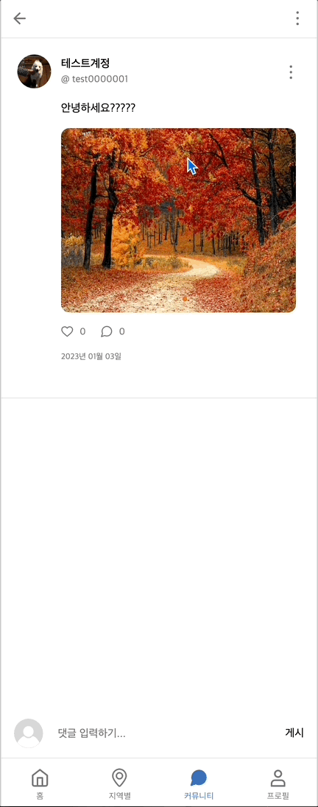                                                                                                             | 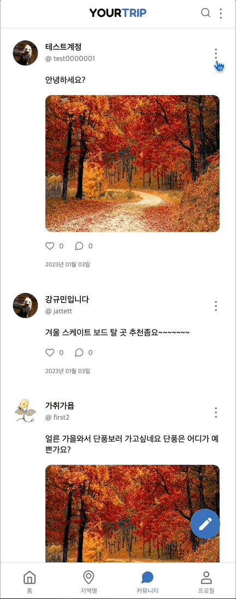                                                                                                        | 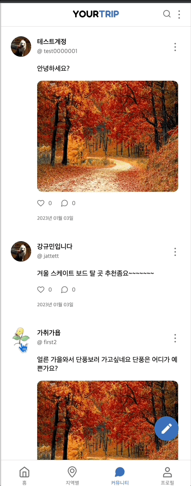                                                               |
| [12. 프로필 페이지](https://github.com/R3act-lion/YOURTRIP/wiki/YOURTRIP#6-%ED%94%84%EB%A1%9C%ED%95%84)                              | [13. 팔로우 팔로잉 리스트](https://github.com/R3act-lion/YOURTRIP/wiki/YOURTRIP#-%ED%8C%94%EB%A1%9C%EC%9B%8C-%EB%B0%8F-%ED%8C%94%EB%A1%9C%EC%9E%89)                   | [14. 프로필 수정](https://github.com/R3act-lion/YOURTRIP/wiki/YOURTRIP#-%ED%94%84%EB%A1%9C%ED%95%84-%EC%88%98%EC%A0%95)                                                | [15. 큐레이션 추가](https://github.com/R3act-lion/YOURTRIP/wiki/YOURTRIP#-%ED%81%90%EB%A0%88%EC%9D%B4%EC%85%98)                     |
|                                                                         | 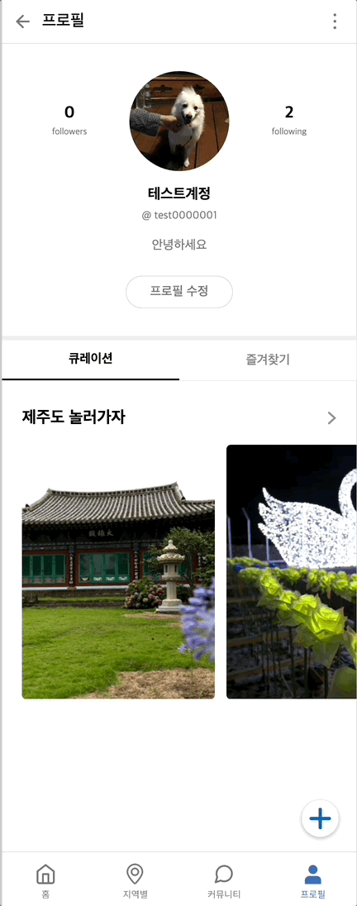                                                                                                       | 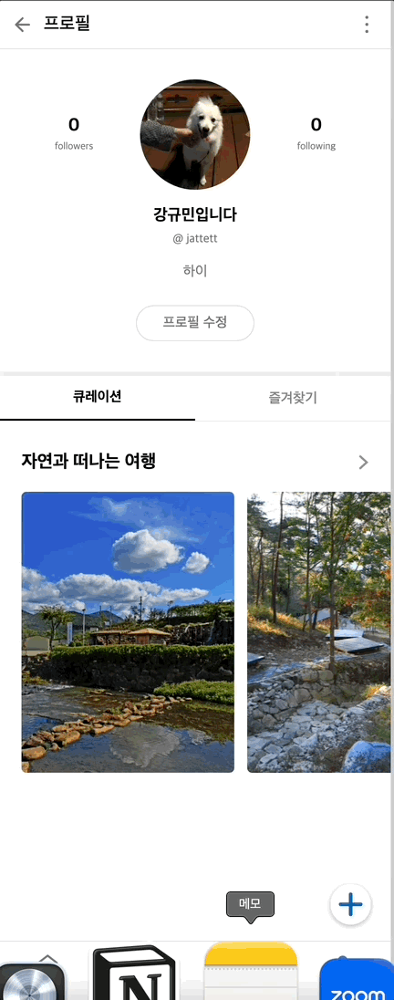                                                                                                                | 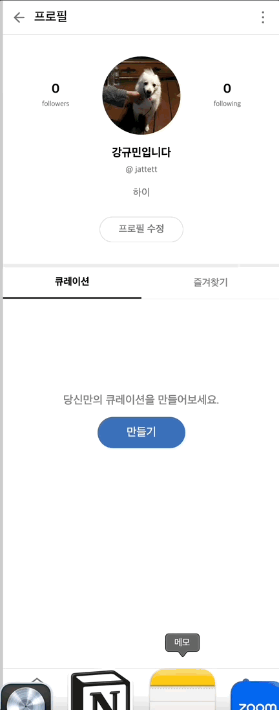                                                                               |

### **[프로젝트 주요 기능 설명]**

- 🛫 공공데이터 API 활용

[Tour API](https://api.visitkorea.or.kr/#/)에서 제공하는 있는 지역별 관광정보 OpenAPI를 활용하여 여행지 정보를 받아와 필요한 형태로 데이터를 가공하여 사용하였다.

- 🛫 지도 API 활용

여행지 상세 설명 페이지에서 여행지 위치를 표시하기 위해 카카오맵 API를 사용하였다.  
여행지 데이티에서 받아온 위도•경도를 활용하여 지도에 해당 위치를 표시하였다.

- 🛫 사용자 관련 정보 저장

제공되는 API를 활용하여 회원가입, 로그인, 프로필 수정 등 개인 정보 저장에 사용하였으며, 팔로우•팔로잉, 다른 사용자의 큐레이션 리스트 확인 등 사용자 간의 상호작용을 구현하였다.  
동일한 API에 커뮤니티, 큐레이션 추가 등 다른 정보를 저장하기 위해 추가적으로 구분할 수 있는 텍스트를 추가하여서 저장하고, 데이터를 받아올 때 텍스트를 통해 구분하여 필요한 데이터를 사용하였다.

<br>

## 4. 트러블 슈팅

<br>

공공 데이터의 API 접근 횟수가 1000회로 상당히 적은 편이고, 용량도 매우 클 뿐더러, 오류가 있는 데이터가 다수 존재한다.

```md
- 프론트앤드 단에서 이를 처리할 경우, 처리 시간이 너무 길어지고 이는 유쾌하지 못한 사용자 경험으로 직결된다.
- 이를 해결하기 위해 데이터를 사전에 처리하여 별도의 깃허브 레포에 저장하고, 이를 배포하여 처리 시간을 단축한다.
- 또한 변경되는 데이터들에 대해 처리할 수 있도록 GitHub Action을 이용하여 주기적으로 데이터를 갱신할 수 있도록 한다.
```

로그인을 하였든 하지 않았든 모든 사용자는 전체 게시글을 확인할 수 있어야 한다.

```md
- 기존의 API를 그대로 활용할 경우 로그인한 사용자만이 자신의 게시글만 확인할 수 있다.
- 이를 해결하기 위해 하나의 공용 계정을 통해 게시물을 업로드한다.
- 이때 게시물 작성자와 게시물 컨텐츠를 파악하기 위해 해당 데이터를 묶어 하나의 객체로 만든 후, 해당 객체가 파싱되지 않게 하기 위해 중괄호를 소괄호로 변경 후 문자열로 만들어 서버로 전달하였다.
- 추후 검색, 수정, 삭제 시 해당 문자열을 다시 객체화하여 이용하였다.
```

여행지 상세 페이지에도 댓글을 확인할 수 있어야 한다.

```md
- 여행지 상세 페이지는 게시글이 아니므로 제공되는 댓글 API를 활용할 수 없다.
- 이를 해결하기 위해 상품 등록 API를 활용하여 댓글을 업로드한다.
- 이때 앞의 경우와 마찬가지로 작성자, 내용 등의 정보를 모아 중괄호를 소괄호로 변경 후 문자열로 만들어 서버로 전달하였다.
- 추후 검색, 수정, 삭제 시 해당 문자열을 다시 객체화하여 이용하였다.
- 또한 상품 이름에는 여행지 댓글이라는 뜻을 가지는 특정 문자열과 여행지의 id를 함께 입력하여 해당 댓글이 어떤 여행지의 댓글인지를 식별할 수 있도록 하였다.
```

모달 컴포넌트 등에서 자식 컴포넌트의 데이터를 부모에게 전달해야 한다.

```md
- props 끌어올리기 : useState를 사용하여 부모와 값을 공유하였다.
```

자식으로 연결된 컴포넌트가 아니라 navigate를 사용하여 이동하는 페이지에서 state 전달이 필요했다.

```md
- navigate의 두번째 인자로 state를 전달할 수 있다는 것을 알게되어 사용하였다.
```

컴포넌트 안에 state를 통해 값을 변경하고자 하였는데 두번째 호출부터 변경되는 문제 발생.

```md
- useEffect를 통해 첫 렌더링시 state가 변경되도록 설정하였다.
```

<br>

## 5. 프로젝트를 마치며

### 5.1 보완할 점

- state 업데이트 시, 렌더링으로 인해 같은 페이지임에도 불구하고 최상단으로 렌더링하여 사용자가 사용하기에 불편하다.
- 리스트를 가로로 출력할 때, 하나의 요소만 가지는 리스트를 드래그 스크롤을 하는 것은 가능하지만 텍스트, 이미지 등 2개 이상의 요소가 포함되어 출력되는 컴포넌트에서 드래그 스크롤이 적용되지 않는다.
- navigate 사용하여 뒤로가기 버튼을 구현하였지만, 다른 페이지로 가는 경우가 발생한다.
- 전체적인 프로젝트 구조가 복잡하며, 컴포넌트를 더욱 세분화하는 것이 가능해보이기 때문에 아토믹 패턴을 적용하여 리팩토링을 진행할 예정이다.
